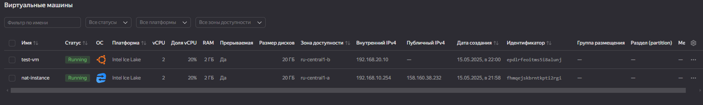

# Домашнее задание к занятию «`Организация сети`» - `Дедюрин Денис`

---
## Задание 1. Yandex Cloud 

1. Создать пустую VPC. Выбрать зону.
2. Публичная подсеть.

 - Создать в VPC subnet с названием public, сетью 192.168.10.0/24.
 - Создать в этой подсети NAT-инстанс, присвоив ему адрес 192.168.10.254. В качестве image_id использовать fd80mrhj8fl2oe87o4e1.
 - Создать в этой публичной подсети виртуалку с публичным IP, подключиться к ней и убедиться, что есть доступ к интернету.
3. Приватная подсеть.
 - Создать в VPC subnet с названием private, сетью 192.168.20.0/24.
 - Создать route table. Добавить статический маршрут, направляющий весь исходящий трафик private сети в NAT-инстанс.
 - Создать в этой приватной подсети виртуалку с внутренним IP, подключиться к ней через виртуалку, созданную ранее, и убедиться, что есть доступ к интернету.

### Ответ:

Все исходники лежат в папке **src** текущего репозитория.

После создания инфраструктуры с VPC, группами безопасностями и ВМ, пробуем подключиться к ВМ, которая имеет буличный адрес и проверить доступ в Интернет:




А так же проверим, что вторая ВМ через подключенную ВМ.


```
ssh -J ubuntu@158.160.38.232
```
```
ping ya.ru
```
```
ping 192.168.20.10
```
Теперь подключимся к самой виртуалке через ssh и проверим с нее доступ в Интернет:


```
ssh -J ubuntu@158.160.38.232 ubuntu@192.168.20.10
```
```
ping ya.ru
```

